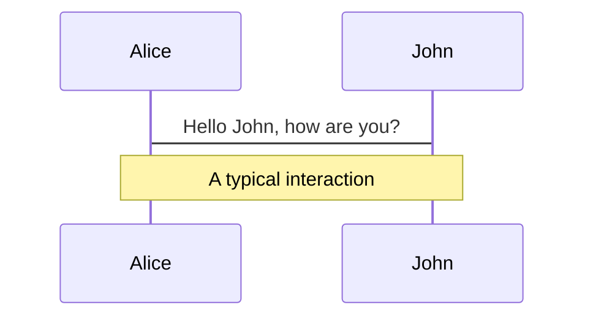
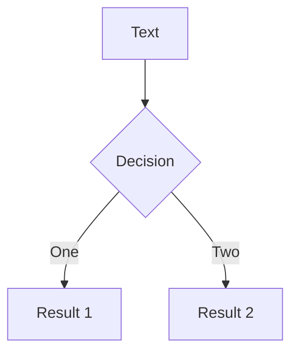
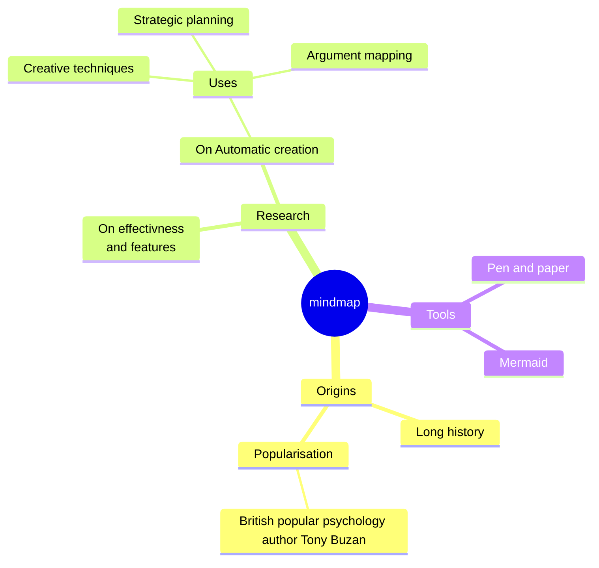
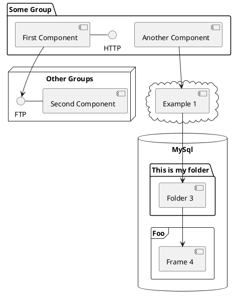

# Videojuego FPS para COSMOX

<div class="pt-12">
    <button @click="$slidev.nav.next" class="button mx-auto ">
<svg viewBox="0 0 16 16" fill="currentColor" height="18" width="18" xmlns="http://www.w3.org/2000/svg" class="game"> <path d="M11.5 6.027a.5.5 0 1 1-1 0 .5.5 0 0 1 1 0zm-1.5 1.5a.5.5 0 1 0 0-1 .5.5 0 0 0 0 1zm2.5-.5a.5.5 0 1 1-1 0 .5.5 0 0 1 1 0zm-1.5 1.5a.5.5 0 1 0 0-1 .5.5 0 0 0 0 1zm-6.5-3h1v1h1v1h-1v1h-1v-1h-1v-1h1v-1z"></path> <path d="M3.051 3.26a.5.5 0 0 1 .354-.613l1.932-.518a.5.5 0 0 1 .62.39c.655-.079 1.35-.117 2.043-.117.72 0 1.443.041 2.12.126a.5.5 0 0 1 .622-.399l1.932.518a.5.5 0 0 1 .306.729c.14.09.266.19.373.297.408.408.78 1.05 1.095 1.772.32.733.599 1.591.805 2.466.206.875.34 1.78.364 2.606.024.816-.059 1.602-.328 2.21a1.42 1.42 0 0 1-1.445.83c-.636-.067-1.115-.394-1.513-.773-.245-.232-.496-.526-.739-.808-.126-.148-.25-.292-.368-.423-.728-.804-1.597-1.527-3.224-1.527-1.627 0-2.496.723-3.224 1.527-.119.131-.242.275-.368.423-.243.282-.494.575-.739.808-.398.38-.877.706-1.513.773a1.42 1.42 0 0 1-1.445-.83c-.27-.608-.352-1.395-.329-2.21.024-.826.16-1.73.365-2.606.206-.875.486-1.733.805-2.466.315-.722.687-1.364 1.094-1.772a2.34 2.34 0 0 1 .433-.335.504.504 0 0 1-.028-.079zm2.036.412c-.877.185-1.469.443-1.733.708-.276.276-.587.783-.885 1.465a13.748 13.748 0 0 0-.748 2.295 12.351 12.351 0 0 0-.339 2.406c-.022.755.062 1.368.243 1.776a.42.42 0 0 0 .426.24c.327-.034.61-.199.929-.502.212-.202.4-.423.615-.674.133-.156.276-.323.44-.504C4.861 9.969 5.978 9.027 8 9.027s3.139.942 3.965 1.855c.164.181.307.348.44.504.214.251.403.472.615.674.318.303.601.468.929.503a.42.42 0 0 0 .426-.241c.18-.408.265-1.02.243-1.776a12.354 12.354 0 0 0-.339-2.406 13.753 13.753 0 0 0-.748-2.295c-.298-.682-.61-1.19-.885-1.465-.264-.265-.856-.523-1.733-.708-.85-.179-1.877-.27-2.913-.27-1.036 0-2.063.091-2.913.27z"></path> </svg>
  Play Now
</button>
</div>

<style>
.button {
  width: 140px;
  height: 40px;
  display: flex;
  align-items: center;
  justify-content: flex-start;
  gap: 10px;
  padding: 0px 15px;
  background-color: red;
  border-radius: 10px;
  border: none;
  color: white;
  position: relative;
  cursor: pointer;
  font-weight: 900;
  transition-duration: .2s;
}

.game path {
  color: white;
}

.button .arrow {
  position: absolute;
  right: 0;
  padding: 0px 5px;
  width: 30px;
  height: 100%;
  font-size: 18px;
  display: flex;
  align-items: center;
  justify-content: center;
}

.button:hover,
.button:focus {
  background-color: black;
  transition-duration: .2s;
}

.button:hover .arrow {
  animation: slide-right .6s ease-out both;
}
/* arrow animation */
@keyframes slide-right {
  0% {
    transform: translateX(-10px);
    opacity: 0;
  }

  100% {
    transform: translateX(0);
    opacity: 1;
  }
}

.button:active {
  transform: translate(1px , 1px);
  transition-duration: .2s;
}
</style>

<!--
The last comment block of each slide will be treated as slide notes. It will be visible and editable in Presenter Mode along with the slide. [Read more in the docs](https://sli.dev/guide/syntax.html#notes)
-->

---
transition: fade-out
layout: image-right
image: ./assets/img/test.jpg
---

# 
<br>

A pesar de la 
<span v-mark.green="0">creciente popularidad y demanda</span>
de los videojuegos FPS en todo 
el mundo, es importante destacar que la plataforma **Cosmox**, a pesar de su amplia
gama de videojuegos, aún <span v-mark.red="1">no cuenta con juegos de este género</span>.
<br>
Esta ausencia representa una oportunidad significativa para expandir la diversidad de juegos
disponibles en la plataforma y satisfacer las preferencias de un segmento más
amplio de jugadores.


<span v-mark.circle.blue="2">Problema cientifico</span>:
¿Cómo se puede <u>diseñar y desarrollar</u> un videojuego FPS eficaz y atractivo para 
la plataforma Cosmox que pueda **enriquecer su catálogo** de juegos y atraer a
un público más amplio?

<!--
You can have `style` tag in markdown to override the style for the current page.
Learn more: https://sli.dev/guide/syntax#embedded-styles
-->

---
transition: fade-out
---
# 
<br>
Objeto de estudio: <br> 
El desarrollo de videojuegos, y el campo de acción es el desarrollo de 
videojuegos de tipo FPS

Objetivo general: <br> 
El desarrollo de un videojuego de supervivencia para el enriquecimiento de la 
plataforma Cosmox

<br>
Se plantean entonces las siguientes tareas de investigación: 
<br>

- Creación del marco teórico a partir del estado del arte referente al desarrollo de videojuegos fps
- Análisis y selección de las herramientas y metodologías para el desarrollo de la propuesta de solución
- Implementación del juego
- Realización de pruebas para verificar el funcionamiento correcto del juego

---
transition: slide-up
level: 2
---

# Historia

<div class="flex">
    <p>
    Los FPS se remontan a <span v-mark.circle.green="0">“Maze War”</span> en 1973, 
    que> es considerado como el primer juego FPS. 
    <br> <br> <br>
    <ul>
        <li> creado por estudiantes de secundaria </li>
        <li> se expandio a un ser un juego de ocho jugadores </li>
        <li> agregaron puntuacion, vista de mapa desde arriba, editor de niveles </li>
    </ul>
    </p>
    <video width="420" controls>
      <source src="assets/video/maze-war.mp4" type="video/mp4" />
    </video>
</div>

---
transition: slide-up
---

# Historia

<div class="flex">
    <div class="flex flex-col">
        <p>
            En la decada de 1990, cuando los gráficos 3D despegaron y se 
            disponía de motores de juegos 3D surgen nuevos juegos mas cercanos 
            a lo que tenemos hoy en dia como 
            <span v-mark.circle.green="0">“Wolfenstein 3D”</span>  (1992) que es a
            menudo citado como el juego que estableció el arquetipo básico de 
            los FPS, y 
            <span v-mark.circle.blue="0">“DOOM”</span> (1993) es frecuentemente
            citado como el juego más influyente en este género
        </p>
        <video width="420" controls>
          <source src="assets/video/doom.webm" type="video/webm" />
        </video>
    </div>
    <video width="420" controls>
        <source src="assets/video/wolfenstein.webm" type="video/webm" />
    </video>
</div>

---
transition: slide-up
level: 2
layout: image-right
image: ./assets/img/test.jpg
---

# FPS 

Son un subgenero de los Shooter entre los que destacan juegos que 
fueron tan influyentes como Call of Duty, Halo, Team Fortress

<br>
Porque 1ra Persona?
<br>
- **Perspectiva inmersiva**: En los juegos en primera persona, **vives la acción desde los ojos del personaje**. Esto crea una conexión más profunda con el juego y te sumerge en su mundo.
    
2. **Realismo y autenticidad**: La vista en primera persona proporciona una sensación de **realismo** al enfrentarte a los desafíos y enemigos. Puedes sentir que estás realmente en el juego.
    
3. **Mayor tensión y emoción**: Al ver el mundo desde la perspectiva del personaje, los momentos de **acción, combate y sorpresa** son más intensos. La adrenalina aumenta cuando te enfrentas a enemigos o resuelves rompecabezas.
    
4. **Exploración detallada**: Puedes **explorar entornos detallados** y descubrir secretos ocultos. La vista en primera persona te permite inspeccionar cada rincón y apreciar los detalles.

---
transition: slide-up
---

## Keyboard Shortcuts

|     |     |
| --- | --- |
| <kbd>right</kbd> / <kbd>space</kbd>| next animation or slide |
| <kbd>left</kbd>  / <kbd>shift</kbd><kbd>space</kbd> | previous animation or slide |
| <kbd>up</kbd> | previous slide |
| <kbd>down</kbd> | next slide |

<!-- https://sli.dev/guide/animations.html#click-animations -->

<p v-after class="absolute bottom-23 left-45 opacity-30 transform -rotate-10">Here!</p>

---
layout: two-cols
layoutClass: gap-16
---

# Table of contents

You can use the `Toc` component to generate a table of contents for your slides:

```html
<Toc minDepth="1" maxDepth="1"></Toc>
```

The title will be inferred from your slide content, or you can override it with `title` and `level` in your frontmatter.

::right::

<Toc v-click minDepth="1" maxDepth="2"></Toc>

---
layout: image-right
image: https://cover.sli.dev
---

# Code

Use code snippets and get the highlighting directly, and even types hover![^1]

```ts {all|5|7|7-8|10|all} twoslash
// TwoSlash enables TypeScript hover information
// and errors in markdown code blocks
// More at https://shiki.style/packages/twoslash

import { computed, ref } from 'vue'

const count = ref(0)
const doubled = computed(() => count.value * 2)

doubled.value = 2
```

<arrow v-click="[4, 5]" x1="350" y1="310" x2="195" y2="334" color="#953" width="2" arrowSize="1" />

<!-- This allow you to embed external code blocks -->
<<< @/snippets/external.ts#snippet

<!-- Footer -->
[^1]: [Learn More](https://sli.dev/guide/syntax.html#line-highlighting)

<!-- Inline style -->
<style>
.footnotes-sep {
  @apply mt-5 opacity-10;
}
.footnotes {
  @apply text-sm opacity-75;
}
.footnote-backref {
  display: none;
}
</style>

<!--
Notes can also sync with clicks

[click] This will be highlighted after the first click

[click] Highlighted with `count = ref(0)`

[click:3] Last click (skip two clicks)
-->

---
level: 2
---

# Shiki Magic Move

Powered by [shiki-magic-move](https://shiki-magic-move.netlify.app/), Slidev supports animations across multiple code snippets.

Add multiple code blocks and wrap them with <code>````md magic-move</code> (four backticks) to enable the magic move. For example:

````md magic-move
```ts {*|2|*}
// step 1
const author = reactive({
  name: 'John Doe',
  books: [
    'Vue 2 - Advanced Guide',
    'Vue 3 - Basic Guide',
    'Vue 4 - The Mystery'
  ]
})
```

```ts {*|1-2|3-4|3-4,8}
// step 2
export default {
  data() {
    return {
      author: {
        name: 'John Doe',
        books: [
          'Vue 2 - Advanced Guide',
          'Vue 3 - Basic Guide',
          'Vue 4 - The Mystery'
        ]
      }
    }
  }
}
```

```ts
// step 3
export default {
  data: () => ({
    author: {
      name: 'John Doe',
      books: [
        'Vue 2 - Advanced Guide',
        'Vue 3 - Basic Guide',
        'Vue 4 - The Mystery'
      ]
    }
  })
}
```

Non-code blocks are ignored.

```vue
<!-- step 4 -->
<script setup>
const author = {
  name: 'John Doe',
  books: [
    'Vue 2 - Advanced Guide',
    'Vue 3 - Basic Guide',
    'Vue 4 - The Mystery'
  ]
}
</script>
```
````

---

# Components

<div grid="~ cols-2 gap-4">
<div>

You can use Vue components directly inside your slides.

We have provided a few built-in components like `<Tweet/>` and `<Youtube/>` that you can use directly. And adding your custom components is also super easy.

```html
<Counter :count="10" />
```

<!-- ./components/Counter.vue -->
<Counter :count="10" m="t-4" />

Check out [the guides](https://sli.dev/builtin/components.html) for more.

</div>
<div>

```html
<Tweet id="1390115482657726468" />
```

<Tweet id="1390115482657726468" scale="0.65" />

</div>
</div>

<!--
Presenter note with **bold**, *italic*, and ~~striked~~ text.

Also, HTML elements are valid:
<div class="flex w-full">
  <span style="flex-grow: 1;">Left content</span>
  <span>Right content</span>
</div>
-->

---
class: px-20
---

# Themes

Slidev comes with powerful theming support. Themes can provide styles, layouts, components, or even configurations for tools. Switching between themes by just **one edit** in your frontmatter:

<div grid="~ cols-2 gap-2" m="t-2">

```yaml
---
theme: default
---
```

```yaml
---
theme: seriph
---
```


</div>

Read more about [How to use a theme](https://sli.dev/themes/use.html) and
check out the [Awesome Themes Gallery](https://sli.dev/themes/gallery.html).

---

# Clicks Animations

You can add `v-click` to elements to add a click animation.

<div v-click>

This shows up when you click the slide:

```html
<div v-click>This shows up when you click the slide.</div>
```

</div>

<br>

<v-click>

The <span v-mark.red="3"><code>v-mark</code> directive</span>
also allows you to add
<span v-mark.circle.orange="4">inline marks</span>
, powered by [Rough Notation](https://roughnotation.com/):

```html
<span v-mark.underline.orange>inline markers</span>
```

</v-click>

<div mt-20 v-click>

[Learn More](https://sli.dev/guide/animations#click-animations)

</div>

---
preload: false
---

# Motions

Motion animations are powered by [@vueuse/motion](https://motion.vueuse.org/), triggered by `v-motion` directive.

```html
<div
  v-motion
  :initial="{ x: -80 }"
  :enter="{ x: 0 }">
  Slidev
</div>
```

<div class="w-60 relative mt-6">
  <div class="relative w-40 h-40">
    
    
    
  </div>

  <div
    class="text-5xl absolute top-14 left-40 text-[#2B90B6] -z-1"
    v-motion
    :initial="{ x: -80, opacity: 0}"
    :enter="{ x: 0, opacity: 1, transition: { delay: 2000, duration: 1000 } }">
    Slidev
  </div>
</div>

<!-- vue script setup scripts can be directly used in markdown, and will only affects current page -->
<script setup lang="ts">
const final = {
  x: 0,
  y: 0,
  rotate: 0,
  scale: 1,
  transition: {
    type: 'spring',
    damping: 10,
    stiffness: 20,
    mass: 2
  }
}
</script>

<div
  v-motion
  :initial="{ x:35, y: 40, opacity: 0}"
  :enter="{ y: 0, opacity: 1, transition: { delay: 3500 } }">

[Learn More](https://sli.dev/guide/animations.html#motion)

</div>

---

# LaTeX

LaTeX is supported out-of-box powered by [KaTeX](https://katex.org/).

<br>

Inline $\sqrt{3x-1}+(1+x)^2$

Block
$$ {1|3|all}
\begin{array}{c}

\nabla \times \vec{\mathbf{B}} -\, \frac1c\, \frac{\partial\vec{\mathbf{E}}}{\partial t} &
= \frac{4\pi}{c}\vec{\mathbf{j}}    \nabla \cdot \vec{\mathbf{E}} & = 4 \pi \rho \\

\nabla \times \vec{\mathbf{E}}\, +\, \frac1c\, \frac{\partial\vec{\mathbf{B}}}{\partial t} & = \vec{\mathbf{0}} \\

\nabla \cdot \vec{\mathbf{B}} & = 0

\end{array}
$$

<br>

[Learn more](https://sli.dev/guide/syntax#latex)

---

# Diagrams

You can create diagrams / graphs from textual descriptions, directly in your Markdown.

<div class="grid grid-cols-4 gap-5 pt-4 -mb-6">









</div>

[Learn More](https://sli.dev/guide/syntax.html#diagrams)

---
src: ./pages/multiple-entries.md
hide: false
---

---

# Monaco Editor

Slidev provides built-in Moanco Editor support.

Add `{monaco}` to the code block to turn it into an editor:

```ts {monaco}
import { ref } from 'vue'
import hello from './external'

const code = ref('const a = 1')
hello()
```

Use `{monaco-run}` to create an editor that can execute the code directly in the slide:

```ts {monaco-run}
function fibonacci(n: number): number {
  return n <= 1
    ? n
    : fibonacci(n - 1) + fibonacci(n - 2) // you know, this is NOT the best way to do it :P
}

console.log(Array.from({ length: 10 }, (_, i) => fibonacci(i + 1)))
```

---
layout: center
class: text-center
---

# Learn More

[Documentations](https://sli.dev) · [GitHub](https://github.com/slidevjs/slidev) · [Showcases](https://sli.dev/showcases.html)
